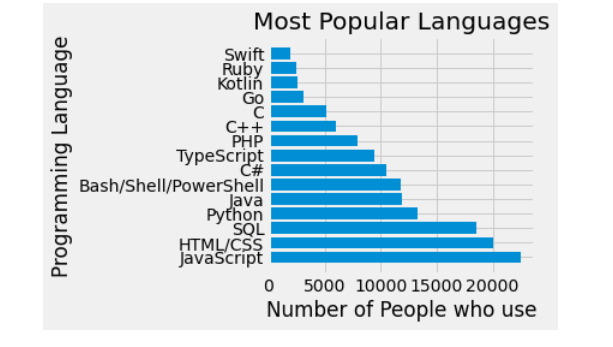
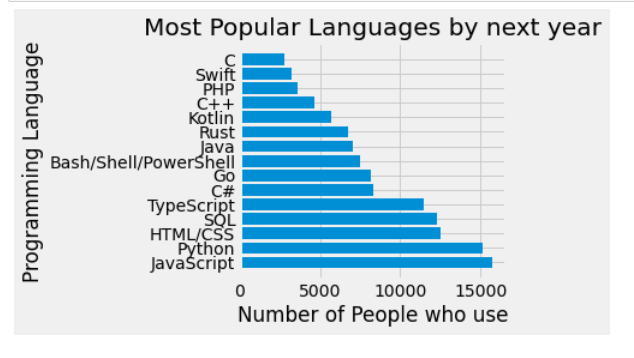
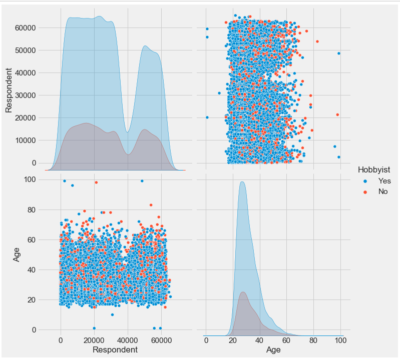
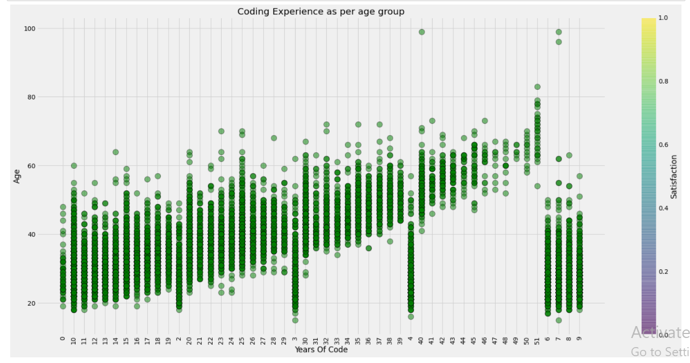
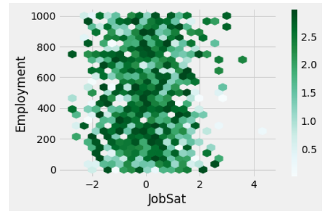

### Overview
This blog post is part of Udacity Project:1 (Write a Data Scientist Blog Post) under Data Scientists Nanodegree Program. Detailed analysis is done based on the project requirement, same is posted in my github repository executed on Jupyter notebook.

### Introduction
Whenever its about data visualization, its always confusing and requires lot of smart work. In this project i have tried to sort out some aspects based on dataset.
Here, I am using the Stack Overflow,2020 Dataset for this blog post, link for the same is mentioned in Reference section below. As part of the Stack Overflow,2020 initiatives, the dataset describes the IT professionals and other professional's future in different countires with different aspects. There are 64461 listings against 61 attributes in the dataset including full descriptions of listings and Payment structure. Due to very large dataset, I have dropped few columns, which were not useful during my data visualization part. 

Motivation behind this project:
If you want to analyse about yours future in terms of job growth, salary growth and Country which can be best for coding type of job, in that case, this project is best because it focuses on answering such questions only.

# Part I: Currently, As a Python Programmer, what scope do i have, and what scope its going to be in future?
 
In the listings there are 15 different Programming languages, which are in scope. Some of these Programming languages are very old whereas some are new, but got pace in IT market.

In the below Bar chart, you can see the comparison between No of languages and popularity for two different years. I would highlight the facts for top 5 languages, which are most popular.

**Currently, most popular Programming langauges among all Countries are:**
* JavaScript
* HTML/CSS
* SQL
* Python
* JAVA

**By next year, Programming langauegs vs Popularity**
* JavaScript
* Python
* HTML/CSS
* SQL
* TypeScript

As we can see here, how the popularity is changing of Programming langauges over a year. 
Pyhton is becoming second most popular language by next year, infact as per numbers, its very close to JavaScript. JAVA langauge is not even in the top5 list by next year.

So its always good to analyse such findings. 
 

Here you can see the comparison between both graph of Programming Languages vs Popularity

Based on above facts, we can calculate many intresting facts, like which Country can be best to work with, how much salary can i expect in future, am i going to be underpaid or overpaid employee. So we can find all these facts easily now based on above facts.

# Part II: Do you take yours job as hobby?
In the chart below, I was interested in, how many developers take their jobs as a hobby and what age group and gender they belong.  

There are some important features of listings. There are different aspects which attract the Professionals. Out of which *Languages, frameworks, and other technologies I’d be working with* aspect attracts more Profesionals, as they want to learn new things and keep themselves updated. 
Also we can see that young age group between 20-30years takes their job as a hobby compared to other age group.
Most of the Professionals are Male among the gender.
Here i am presenting one pairplot , rest plots can be seen in my github repository.

 

# Part III: Which age group got good experience in Programming and do employees prefer to work full time or part time? Discuss about countries too in terms of employment?

Here, we can see that people between 20-40 Years age group got comparatively less experience, Ofcourse due to the young age group, but intresting fact is that between 40-50 years many employees leave their jobs and start doing something else. Mostly employees prefer to work full time. 
Hexagonal plot depicts about job satisfaction among employees, since i have chosen 1000 employees data only to show the result clearly.
Many students or major part of the students, who are pursuing their under graduation, they are doing it in Programming or Software field. So we can say that as a programmer or software engineer we have secure future.

### Conclusion
In this article, we tried to find out whether yours future/career is safe as programmer ? If yes, then upto what extent.

1. In my first question i tried to find out about my job scope, and after making suitable comparisons between Graph above I found out that as a Python programmer i am into the right field, and Python language got better scope in future.

2. We then looked at how many Employees take their job as a Hobby, and what age group and gender they belong.
Surprisingly, as per the Stack OverFlow 2020 data, Mostly employees between 20-30 years take their job as hobby, but slowly slowly it gets reduce as they become experinced or say after 30-40 years age. Mostly software programmers are Male. 

So we can say that when we join the job we enjoy it the most.

3. Finally, we found about age group and coding experince related to them, and approximately what proportion of the employees prefer to work on full time basis and part time basis. In same question I tried to relate level of job satisfaction with employees, as this factor is very important to know for any company.
According to the concluded graphs, 20-40years age group got lesser coding experince as they are young, but intresting fact is that mostly employees leave their job between 40-50 years. I tried to relate job satisfaction with 1000 employees, and found that there are more unsatisfied employees comparad to satisfied empployees, Since difference is not large, but its on significant level as per Hexagonal bin plot. 

The findings here are observational, and still need to know the real question

> Do you want to continue as a Python Programmer ?

To see more about this analysis, see the link to my Github available [here](https://github.com/rachit1010/rachit/blob/main/Worksheet%207_final.ipynb).

### References: 

